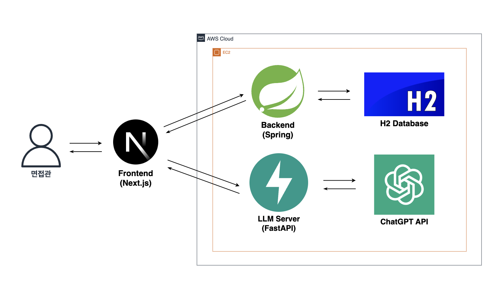
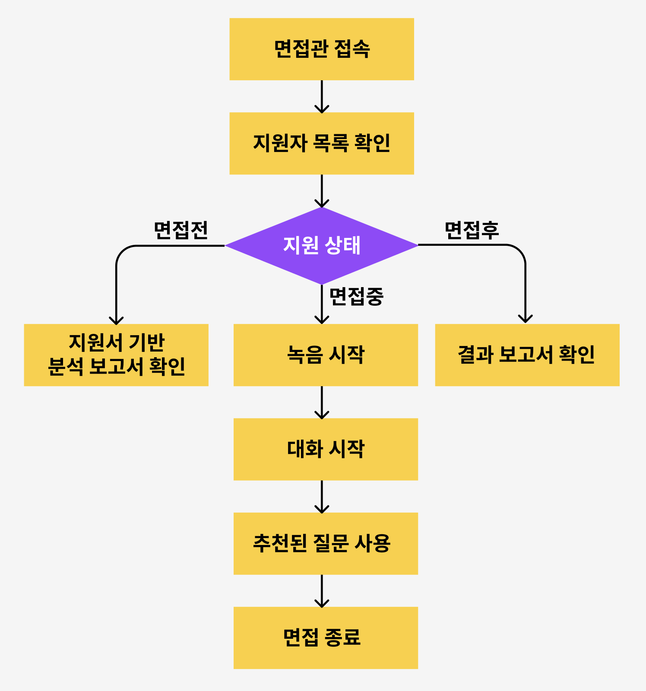
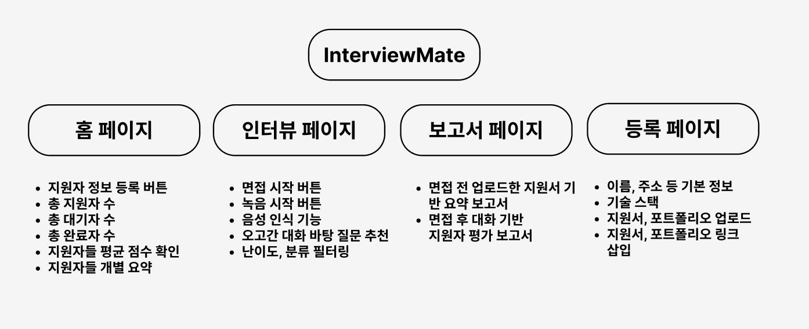
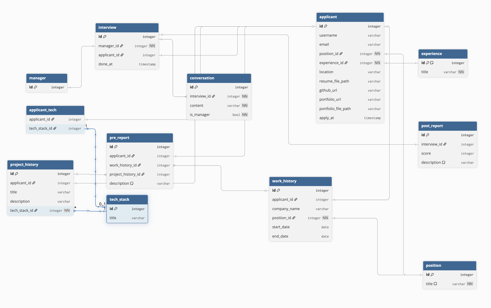
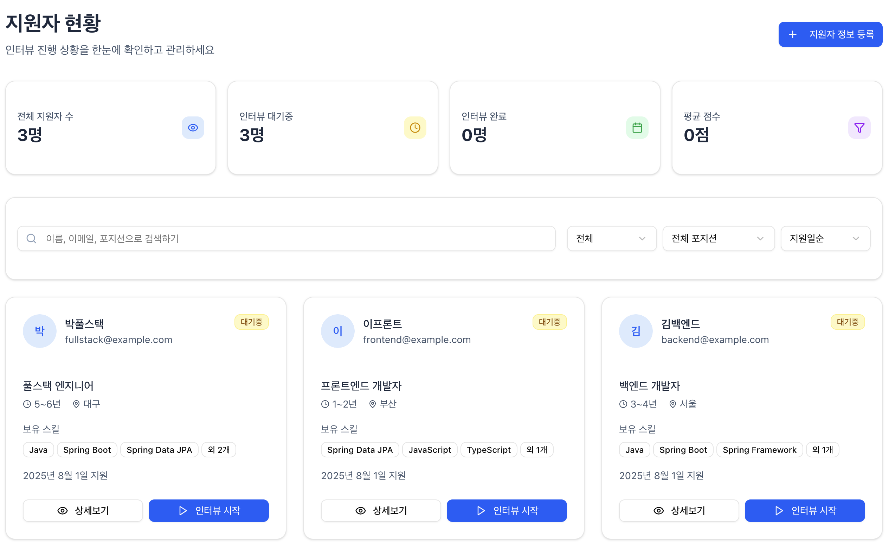
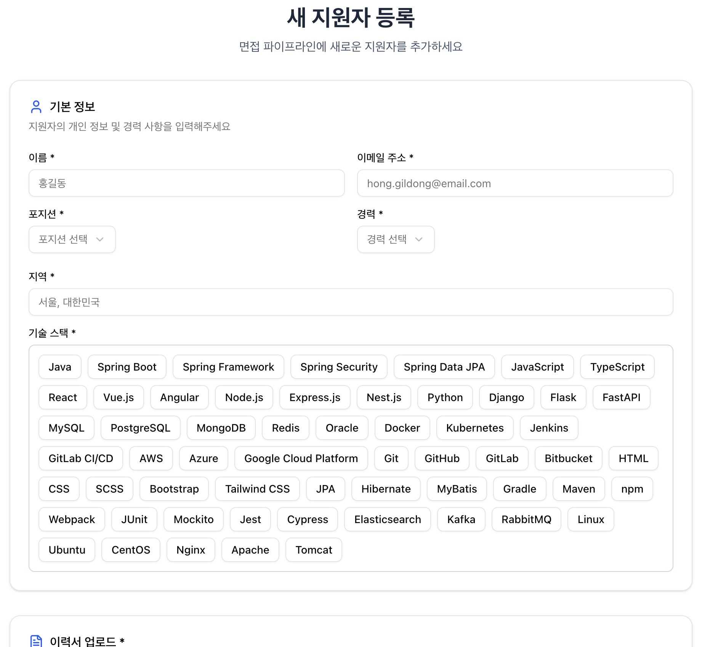
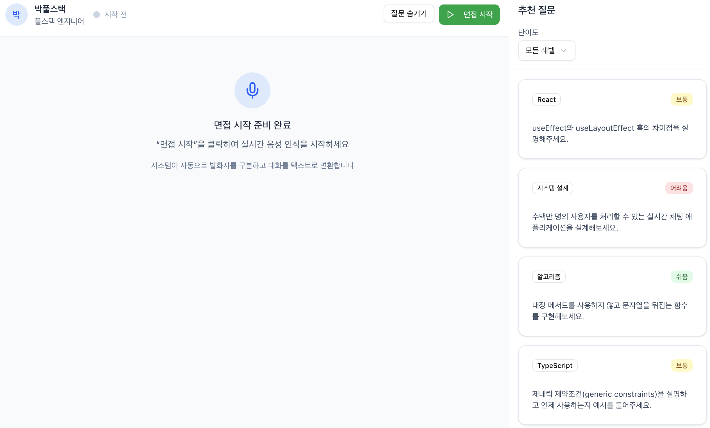
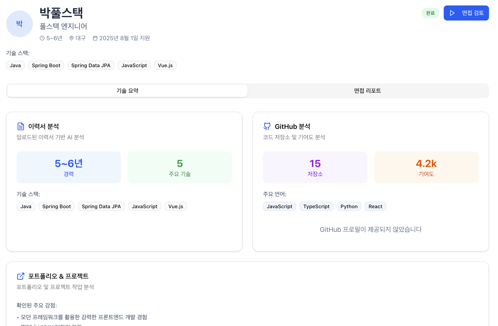

### 1. 프로젝트 소개
#### 1.1. 개발배경 및 필요성
IT 대기업이 아닌 경우 전문 면접관의 부재로 인해 체계적인 면접 진행이 어렵고, 기술의 고도화로 기술 면접이 계속 어려워지며, 기술 면접에만 치중될 경우 지원자의 인성과 소프트 스킬을 평가하기 힘든 문제가 있습니다.
<br/>

#### 1.2. 개발목표 및 주요내용
면접관을 지원하는 AI 기반 면접 보조 시스템을 통해 효과적이고 체계적인 면접 진행을 가능하게 하고, 실시간으로 추천 질문을 제공하여 면접의 질을 향상시키는 것입니다.
<br/>

#### 1.3. 세부내용
실시간 음성 인식을 통한 면접 대화 트래킹, AI 기반 추천 질문 생성, 면접 종료 후 상세한 결과 리포트 제공, 면접 복기 기능, 그리고 지원자 전체 현황 관리 기능을 포함합니다.
<br/>

#### 1.4. 기존 서비스(상품) 대비 차별성
기존 면접 도구들과 달리 실시간으로 면접 대화를 분석하여 즉석에서 맞춤형 질문을 추천하고, 면접관의 판단을 보조하는 능동적인 지원 시스템으로서 차별화됩니다.
<br/>

#### 1.5. 사회적가치 도입 계획
중소기업과 스타트업의 면접 역량 강화를 통해 우수한 인재 확보를 지원하고, 공정하고 체계적인 면접 문화를 확산시켜 취업 시장의 균형 발전에 기여할 계획입니다.
<br/>


### 2.상세설계
#### 2.1. 시스템 구성도

<br/>

#### 2.3. 사용기술
| 분야 | 이름 | 버전 |
|:-----:|:---------------------:|:-------:|
| **Backend** | Java | 17 |
|  | Spring Boot | 3.5.3 |
|  | Spring Data JPA | - |
|  | H2 Database | - |
| **Frontend** | Next.js | 15.2.4 |
|  | React | 19.0.0 |
|  | TypeScript | 5 |
|  | Tailwind CSS | 4.1.11 |
| **LLM Server** | Python | 3.13+ |
|  | FastAPI | 0.116.1+ |
|  | LangChain | 0.3.27+ |
| **Cloud** | Google Cloud Speech API | 7.2.0 |
<br/>


### 3. 개발결과
#### 3.1. 전체시스템 흐름도
##### 유저 플로우 차트

<br/>

##### IA(Information Architecture)

<br/>

##### ERD

<br/>

#### 3.2. 기능설명
##### ` 메인 페이지 `

<br/>

- 대시보드
  - 진행 중인 면접과 완료된 면접 현황을 한눈에 확인할 수 있습니다.
  - 최근 면접 결과와 평가 점수를 요약해서 보여줍니다.

- 면접 일정 관리
  - 예정된 면접 일정과 지원자 정보를 확인할 수 있습니다.
  - 면접 시작 버튼을 클릭하여 바로 면접을 진행할 수 있습니다.

- 지원자 관리
  - 전체 지원자 목록과 지원 포지션을 확인할 수 있습니다.
  - 각 지원자의 면접 진행 상태와 결과를 조회할 수 있습니다.
<br/>

##### ` 등록 페이지 `

<br/>

- 지원자 정보 입력
  - 이름, 이메일, 연락처 등 기본 정보를 입력합니다.
  - 지원 포지션과 경력 사항을 선택하고 입력할 수 있습니다.

- 기술 스택 선택
  - 보유한 기술 스택을 체크박스로 선택할 수 있습니다.
  - 각 기술에 대한 숙련도를 단계별로 설정할 수 있습니다.

- 이력서 업로드
  - PDF 형태의 이력서 파일을 업로드할 수 있습니다.
  - 업로드된 이력서는 면접 시 참고 자료로 활용됩니다.
<br/>

##### ` 인터뷰 페이지 `

<br/>

- 실시간 음성 인식
  - 면접 대화가 실시간으로 텍스트로 변환되어 화면에 표시됩니다.
  - Google Cloud Speech API를 활용한 정확한 음성 인식을 제공합니다.

- AI 질문 추천
  - 면접 진행 상황을 분석하여 적절한 후속 질문을 실시간으로 추천합니다.
  - 기술 면접과 인성 면접 질문이 균형있게 제공됩니다.

- 면접 진행 상황
  - 면접 시간과 진행률을 실시간으로 확인할 수 있습니다.
  - 주요 키워드와 평가 포인트가 하이라이트되어 표시됩니다.

##### ` 인터뷰 보고서 페이지 `

<br/>
- 종합 평가 결과
  - AI 분석을 통한 지원자의 기술 역량과 커뮤니케이션 능력 평가를 제공합니다.
  - 각 평가 항목별 점수와 상세 피드백을 확인할 수 있습니다.

- 면접 대화 분석
  - 전체 면접 내용의 텍스트 기록과 주요 대화 구간을 제공합니다.
  - 지원자의 답변 패턴과 키워드 분석 결과를 시각화하여 보여줍니다.

- 개선 제안사항
  - 향후 면접 진행 시 개선할 수 있는 질문 방향과 평가 포인트를 제안합니다.
  - 지원자 유형별 맞춤형 면접 가이드를 제공합니다.

#### 3.4. 디렉토리 구조
```
PNUSW-09/
├── backend/                    # Spring Boot 백엔드
│   └── interviewAI/
│       └── src/main/java/studyGroup/interviewAI/
│           ├── controller/     # REST API 컨트롤러
│           ├── entity/         # JPA 엔티티
│           ├── repository/     # 데이터 접근 계층
│           └── service/        # 비즈니스 로직
├── frontend/                   # Next.js 프론트엔드
│   ├── app/                    # 페이지 라우팅
│   │   ├── interview/[id]/     # 면접 진행 페이지
│   │   ├── candidates/[id]/    # 지원자 관리 페이지
│   │   └── api/speech/         # 음성 처리 API
│   └── components/             # 재사용 가능한 컴포넌트
├── llm-server/                 # Python LLM 서버
│   ├── main.py                 # FastAPI 메인 서버
│   ├── prompts.py              # LLM 프롬프트 관리
│   └── question_generator.py   # 질문 생성 로직
└── assets/                     # README 이미지 자료
```
<br/>


### 4. 설치 및 사용 방법

#### 4.1. Frontend (Next.js)
```bash
$ cd frontend
$ npm i
$ npm run dev
```
- 브라우저에서 `http://localhost:3000` 접속

#### 4.2. Backend (Spring Boot)
```bash
$ cd backend/interviewAI/interviewAI
$ ./gradlew bootRun
```
- 또는 IDE에서 `InterviewAiApplication.java` 실행
- 서버 실행 후 `http://localhost:8080` 접속

#### 4.3. LLM Server (FastAPI)
```bash
$ cd llm-server
$ uv run main.py
```
- 서버 실행 후 `http://localhost:8000` 접속
<br/>


### 5. 소개 및 시연영상
[](https://youtu.be/znU13XX5PZ4)

<br/>

### 6. 팀 소개
| 김은종 | 여채언 | 김성윤 | 문성재 | 최지은 | 허동혁 |
|:-------:|:-------:|:-------:|:-------:|:-------:|:-------:|
| |  |  |  |  |  |
| eunjong147@pusan.ac.kr | codjs2659@pusan.ac.kr | kimsoungyoon01@gmail.com | paulmoon00@naver.com | eaee20171@gmail.com | missko30@pusan.ac.kr |
| 기획, 개발 | 인프라 구축 <br/> 백엔드 개발 | DB 설계 | 백엔드 개발 | LLM 서버 개발 | 프론트엔드 개발 |


<br/>


### 7. 해커톤 참여 후기
- 김은종
  > 면접관의 어려움에서 시작된 아이디어가 실제 동작하는 서비스로 구현되는 과정이 정말 보람찼습니다. 팀원들과 토론하며 기획을 다듬어가는 시간이 가장 기억에 남습니다.
- 여채언
  > Spring Boot와 인프라 설정을 담당하면서 안정적인 백엔드 시스템 구축의 중요성을 다시 한번 느꼈습니다. 특히 실시간 음성 처리를 위한 API 설계가 흥미로운 도전이었어요.
- 김성윤
  > 면접 데이터의 복잡한 관계를 ERD로 설계하면서 데이터베이스 모델링의 깊이를 경험할 수 있었습니다. 효율적인 쿼리 성능을 고려한 테이블 설계가 특히 재밌었습니다.
- 문성재
  > REST API 설계와 JPA 연동을 통해 백엔드 개발 실력을 한층 더 향상시킬 수 있었습니다. 프론트엔드와의 원활한 데이터 통신을 위한 API 설계가 인상 깊었어요.
- 최지은
  > LangChain과 FastAPI를 활용한 LLM 서버 개발이 정말 흥미로웠습니다. 실시간으로 면접 맥락을 파악해서 적절한 질문을 생성하는 AI 로직을 구현하는 과정에서 많은 것을 배웠어요.
- 허동혁
  > Next.js와 React로 직관적인 면접 인터페이스를 만들면서 사용자 경험의 중요성을 깨달았습니다. 실시간 음성 인식과 질문 추천 기능을 자연스럽게 통합하는 UI 설계가 가장 보람찼던 것 같습니다.
<br/>
